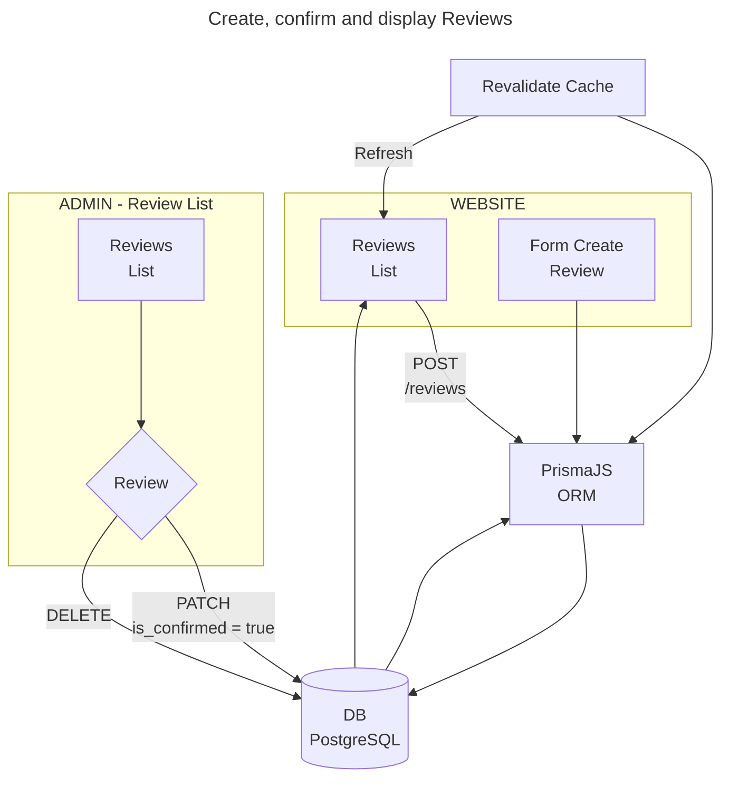

# EMS - Employment Management System

<a alt="Nx logo" href="https://nx.dev" target="_blank" rel="noreferrer"></a>

✨ **This workspace has been generated by [Nx, Smart Monorepos · Fast CI.](https://nx.dev)** ✨

## Application flow




## Running tasks

To execute tasks with Nx use the following syntax:

### WEBSITE (NextJS):

```
npx nx serve website        // http://localhost:4300
npx nx storybook website    // ?

```

### BACKEND (NestJS):

```
npx nx serve backend      // http://localhost:3000
```

### ADMIN (ReactJS):

```
npx nx serve admin        // http://localhost:4200
npx nx storybook admin    // http://localhost:4400
npx nx build admin
```

### COMMON-UI:

```
npx nx serve common-ui    // http://localhost:4600

```

### PRISMA:

If you want run database locally you need to create docker container by running a command:

```
docker compose up
```

then, if you want open prisma studio (localhost:5555) run:

```

```

```
cd libs/prisma-schema
export DATABASE_URL=<your_database_url>
npx nx run prisma-schema:studio
```

If you want to generate prisma types (automatically file prisma-schema/prisma/generated/zod/index.ts will be updated) run:

```
cd libs/prisma-schema
export DATABASE_URL=<your_database_url>
npx nx run prisma-schema:generate-types
```

If you want to migrate currenctly made changes run:

```
cd libs/prisma-schema
export DATABASE_URL=<your_database_url>
npx nx run prisma-schema:migrate
```

Targets can be defined in the `package.json` or `projects.json`. Learn more [in the docs](https://nx.dev/features/run-tasks).

## Explore the project graph

Run `npx nx graph` to show the graph of the workspace.
It will show tasks that you can run with Nx.

- [Learn more about Exploring the Project Graph](https://nx.dev/core-features/explore-graph)

## Connect with us!

- [Join the community](https://nx.dev/community)
- [Subscribe to the Nx Youtube Channel](https://www.youtube.com/@nxdevtools)
- [Follow us on Twitter](https://twitter.com/nxdevtools)
